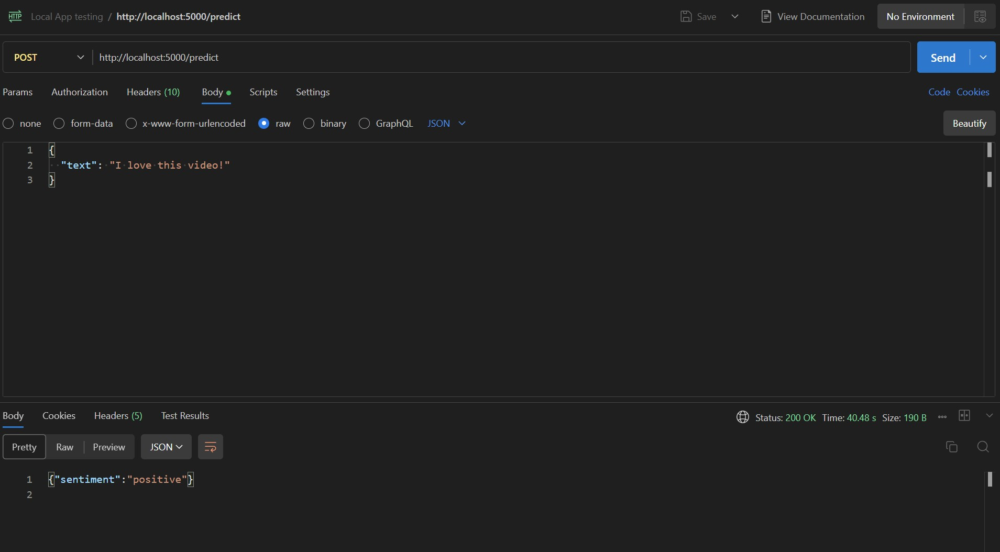

# Sentiment Analysis of YouTube Comments with BERT

[]()
[](https://hub.docker.com/repositories/rahulk98/youtubecomment-sentiment-predictor)
[](https://huggingface.co/rahulk98/bert-finetuned-youtube_sentiment_analysis)

## Overview

This project fine-tunes a BERT model to classify YouTube comments into sentiment categories (positive, negative, neutral). The model achieves a macro F1-score of **0.82** on an imbalanced dataset of 10,000+ comments. The trained model is deployed as a containerized API for easy integration into applications.

- **Dataset**: [Kaggle YouTube Comments Dataset](https://www.kaggle.com/datasets/atifaliak/youtube-comments-dataset/data)
- **Hugging Face Model**: [bert-finetuned-youtube_sentiment_analysis](https://huggingface.co/rahulk98/bert-finetuned-youtube_sentiment_analysis/)
- **Docker Image**: [rahulk98/youtubecomment-sentiment-predictor](https://hub.docker.com/repositories/rahulk98/youtubecomment-sentiment-predictor)

## Table of Contents

- [Project Structure](#project-structure)
- [Model Performance](#model-performance)
- [API Usage](#api-usage)
- [Docker Setup](#docker-setup)
- [Local Development](#local-development)
- [Example Response](#example-response)
- [How It Works](#how-it-works)
- [Training Process](#training-process)

## Project Structure

```
├── Dockerfile                # Docker configuration for containerizing the API
├── README.md                 # Project documentation
├── images/                   # Screenshots and images for documentation
│   └── postman_response.jpg  # Example API response from Postman
├── notebooks/                # Jupyter notebooks for model training
│   ├── main.ipynb            # Training notebook for BERT fine-tuning
│   └── requirements.txt      # Python dependencies for training
└── src/                      # Source code for the API
    ├── app.py                # Flask API entry point
    ├── predict.py            # Prediction module using the trained model
    └── requirements.txt      # Python dependencies for the API
```

## Model Performance

The model achieves excellent performance on the YouTube comments dataset:

**F1 score (macro):** 0.8182257811696632

**Confusion matrix:**
```
[[ 161   59   14]
 [  16  375   71]
 [   8   85 1047]]
```

The model can classify comments into three sentiment categories:
- Neutral
- Positive
- Negative

## API Usage

The API is accessible via HTTP POST requests to the `/predict` endpoint.

### Request Format

- **URL**: `http://<host>:5000/predict`
- **Method**: POST
- **Headers**: `Content-Type: application/json`
- **Body**:
  ```json
  {
    "text": "Your YouTube comment text here"
  }
  ```

### Response Format

```json
{
  "sentiment": "positive"
}
```

The response will contain the predicted sentiment, which can be one of:
- `"positive"`
- `"negative"`
- `"neutral"`

## Docker Setup

The API is containerized and available as a Docker image for easy deployment.

### Pull the Docker Image

```bash
docker pull rahulk98/youtubecomment-sentiment-predictor
```

### Run the Docker Container

```bash
docker run -p 5000:5000 rahulk98/youtubecomment-sentiment-predictor
```

This will start the API service on port 5000.

## Local Development

If you want to run the API locally without Docker:

1. **Clone the repository**:
   ```bash
   git clone https://github.com/yourusername/Sentiment-Analysis-with-BERT-Model.git
   cd Sentiment-Analysis-with-BERT-Model
   ```

2. **Install dependencies**:
   ```bash
   pip install -r src/requirements.txt
   ```

3. **Run the API**:
   ```bash
   cd src
   python app.py
   ```

## Example Response

Below is an example of the API response from Postman:



## How It Works

The API uses a fine-tuned BERT model to predict the sentiment of YouTube comments. The model was trained on a dataset of over 10,000 YouTube comments with manually labeled sentiments.

The prediction process:
1. The input text is tokenized using BERT tokenizer
2. The tokenized text is passed through the fine-tuned BERT model
3. The model outputs probabilities for each sentiment class
4. The class with the highest probability is returned as the prediction

## Training Process

The model was fine-tuned using:
- Base model: `bert-base-uncased`
- Custom weighted loss function to handle class imbalance
- Learning rate: 5e-5
- Training epochs: 5
- Batch size: 16

For more details on the training process, check the `notebooks/main.ipynb` file.

